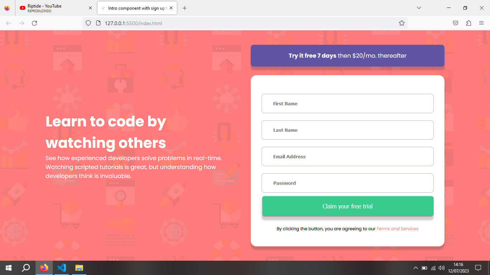
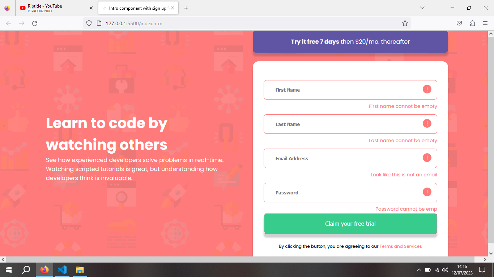
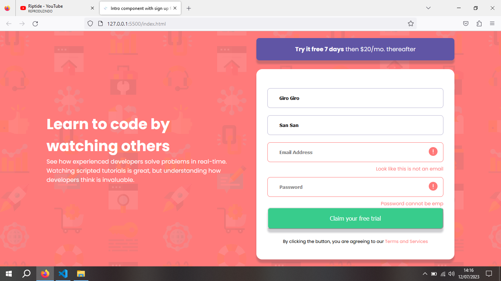
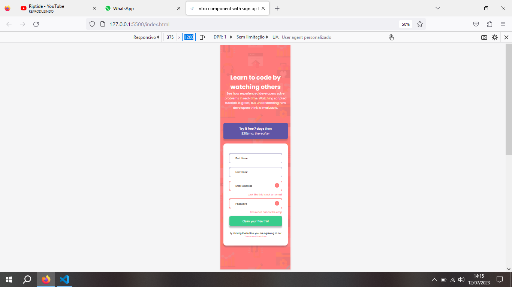

<h1>Desafio Frontend Mentor Intro component!</h1>
 

Desafio proposto pelo Frontend Mentor, onde realizei utilizando HTML, CSS e Javascript.

 

Neste desafio, eu consegui realizar o HTML e o CSS sem dificuldades. Utilizei tags semanticas para o mesmo, utilizei também tags que aprendii em outros exercícios, como por exemplo a tag SMALL e FORM. 

 
<h2>Imagem Desktop </h2>
 

 

 
<h2>Imagem Desktop sem nenhum campo preenchido. </h2>
 

 

 
<h2>Imagem Desktop com alguns campos preenchidos e alguns não.</h2>
 

 

 
<h2>Imagem do layout em desktop 375px.</h2>
 

 
<h3>Conclusóes sobre o projeto</h3>
 

Fiquei contente com o resultado alcançado nesse projeto, pois fiz o JS com o conhecimento que adquiri até o momento. Fiz sem utilizar tutoriais. Gostei do desafio.

 
